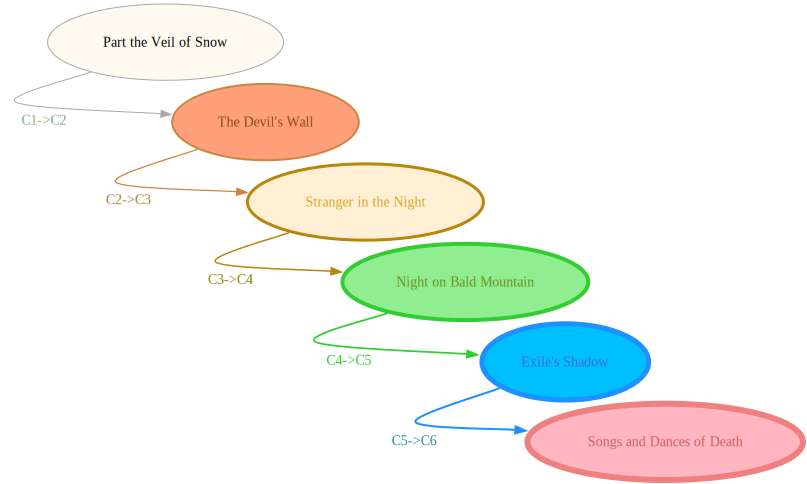
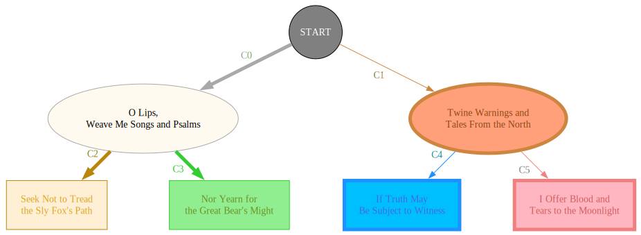

SVG Diagram
===========

[](https://github.com/CyberZHG/SVGDiagram/actions/workflows/cpp-unit-test.yml)
[](https://coveralls.io/github/CyberZHG/SVGDiagram?branch=main)

A library for rendering diagrams to SVG. This library does not provide any automatic layout for nodes and edges.

## Examples

Click the image to see the code that generated it:

|   [](./tests/example/test_example_pentagon.cpp)   | [](./tests/example/test_example_pentagram.cpp) |
|:---------------------------------------------------------------------------------------:|:-------------------------------------------------------------------------------------:|
| [](./tests/example/test_example_sequential.cpp) |  [](./tests/example/test_example_subgraph.cpp)  |

## Development

To enable tests, add the following to your CMake options:

```bash
-DGRAPH_LAYOUT_BUILD_TESTS=ON
```

## Optional Requirements

By default, this library estimates text dimensions using approximations. For more accurate measurements, PangoCairo can be enabled.

To install PangoCairo:

MacOS:

```bash
brew install cairo pango pkg-config
```

Linux:

```bash
sudo apt install libcairo2-dev libpango1.0-dev pkg-config
```

To enable PangoCairo, add the following to your CMake options:

```bash
-DSVG_DIAGRAM_ENABLE_PANGO_CAIRO=ON
```
