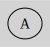

Diagram Attributes
==================

## Background

The generated SVG has no background by default.

`````{tab-set}
````{tab-item} Python
```python
from sp_svg_diagram import SVGDiagram

diagram = SVGDiagram()
diagram.set_background_color("lightgray")
node = diagram.add_node("A")
node.set_label("A")
svg = diagram.render()
```
````
````{tab-item} JavaScript
```javascript
import { SVGDiagram } from 'sp-svg-diagram';

const diagram = new SVGDiagram();
diagram.setBackgroundColor("lightgray");
const node = diagram.addNode("A");
node.setLabel("A");
const svg = diagram.render();
````

````{tab-item} C++
```c++
#include "svg_diagram.h"
using namespace svg_diagram;

int main() {
    SVGDiagram diagram;
    diagram.setBackgroundColor("lightgray");
    const auto node = diagram.addNode("A");
    node->setLabel("A");
    diagram.render("background_color.svg");
    return 0;
}
````
`````


