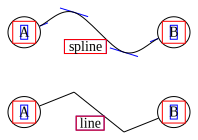
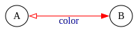

Edge Attributes
===============

## Splines

When connection points are provided, the `splines` of an `SVGEdge` default to cubic Bézier curves.


`````{tab-set}
````{tab-item} Python
```python
from sp_svg_diagram import SVGDiagram, SVGEdge

diagram = SVGDiagram()
splines_types = [
    SVGEdge.SPLINES_SPLINE,
    SVGEdge.SPLINES_LINE,
]
for i, splines in enumerate(splines_types):
    y = i * 80.0
    tail_id, head_id = f"A{i}", f"B{i}"
    node1 = diagram.add_node(tail_id)
    node1.set_center(0, y)
    node1.set_label("A")
    node2 = diagram.add_node(head_id)
    node2.set_center(150, y)
    node2.set_label("B")
    edge = diagram.add_edge(tail_id, head_id)
    edge.set_splines(splines)
    edge.add_connection_point(50, y - 20)
    edge.add_connection_point(100, y + 20)
    edge.set_label(splines)
svg = diagram.render()
```
````
````{tab-item} JavaScript
```javascript
import { SVGDiagram, SVGEdge } from 'sp-svg-diagram';

const diagram = new SVGDiagram();
const splinesTypes = [
    SVGEdge.SPLINES_SPLINE,
    SVGEdge.SPLINES_LINE,
];
for (const [i, splines] of splinesTypes.entries()) {
    const y = i * 80.0;
    const tailID = `A${i}`;
    const headID = `B${i}`;
    const node1 = diagram.addNode(tailID);
    node1.setCenter(0, y);
    node1.setLabel("A");
    const node2 = diagram.addNode(headID);
    node2.setCenter(150, y);
    node2.setLabel("B");
    const edge = diagram.addEdge(tailID, headID);
    edge.setSplines(splines);
    edge.addConnectionPoint(50, y - 20);
    edge.addConnectionPoint(100, y + 20);
    edge.setLabel(splines);
}
const svg = diagram.render();
````

````{tab-item} C++
```c++
#include "svg_diagram.h"
#include <vector>
#include <format>
using namespace svg_diagram;

int main() {
    SVGDiagram diagram;
    const auto splinesTypes = std::vector{
        SVGEdge::SPLINES_SPLINE,
        SVGEdge::SPLINES_LINE,
    };
    for (int i = 0; i < static_cast<int>(splinesTypes.size()); i++) {
        const double y = i * 80.0;
        const auto tailNodeID = std::format("A{}", i);
        const auto headNodeID = std::format("B{}", i);
        const auto node1 = diagram.addNode(tailNodeID);
        node1->setCenter(0, y);
        node1->setLabel("A");
        const auto node2 = diagram.addNode(headNodeID);
        node2->setCenter(150, y);
        node2->setLabel("B");
        const auto edge = diagram.addEdge(tailNodeID, headNodeID);
        edge->setSplines(splinesTypes[i]);
        edge->addConnectionPoint(50, y - 20);
        edge->addConnectionPoint(100, y + 20);
        edge->setLabel(std::string(splinesTypes[i]));
    }
    diagram.render("splines.svg");
    return 0;
}
````
`````


In the figure below, you can see the tangent directions of the curve at the connection points.



## Arrow

You can set the arrow styles for the start and end points; by default, no arrows are applied.

`````{tab-set}
````{tab-item} Python
```python
from sp_svg_diagram import SVGDiagram, SVGEdge

diagram = SVGDiagram()
arrow_types = [
    SVGEdge.ARROW_NONE,
    SVGEdge.ARROW_NORMAL,
    SVGEdge.ARROW_EMPTY,
]
for i, arrow in enumerate(arrow_types):
    y = i * 60.0
    tail_id, head_id = f"A{i}", f"B{i}"
    node1 = diagram.add_node(tail_id)
    node1.set_center(0, y)
    node1.set_label("A")
    node2 = diagram.add_node(head_id)
    node2.set_center(150, y)
    node2.set_label("B")
    edge = diagram.add_edge(tail_id, head_id)
    edge.set_arrow_tail(SVGEdge.ARROW_NONE)
    edge.set_arrow_head(arrow)
    edge.set_label(arrow)
svg = diagram.render()
```
````
````{tab-item} JavaScript
```javascript
import { SVGDiagram, SVGEdge } from 'sp-svg-diagram';

const diagram = new SVGDiagram();
const arrowTypes = [
    SVGEdge.ARROW_NONE,
    SVGEdge.ARROW_NORMAL,
    SVGEdge.ARROW_EMPTY,
];
for (const [i, arrow] of arrowTypes.entries()) {
    const y = i * 60.0;
    const tailID = `A${i}`;
    const headID = `B${i}`;
    const node1 = diagram.addNode(tailID);
    node1.setCenter(0, y);
    node1.setLabel("A");
    const node2 = diagram.addNode(headID);
    node2.setCenter(150, y);
    node2.setLabel("B");
    const edge = diagram.addEdge(tailID, headID);
    edge.setArrowTail(SVGEdge.ARROW_NONE);
    edge.setArrowHead(arrow);
    edge.setLabel(arrow);
}
const svg = diagram.render();
````

````{tab-item} C++
```c++
#include "svg_diagram.h"
#include <vector>
#include <format>
using namespace svg_diagram;

int main() {
    SVGDiagram diagram;
    const auto arrowTypes = std::vector{
        SVGEdge::ARROW_NONE,
        SVGEdge::ARROW_NORMAL,
        SVGEdge::ARROW_EMPTY,
    };
    for (int i = 0; i < static_cast<int>(arrowTypes.size()); i++) {
        const double y = i * 60.0;
        const auto tailNodeID = std::format("A{}", i);
        const auto headNodeID = std::format("B{}", i);
        const auto node1 = diagram.addNode(tailNodeID);
        node1->setCenter(0, y);
        node1->setLabel("A");
        const auto node2 = diagram.addNode(headNodeID);
        node2->setCenter(150, y);
        node2->setLabel("B");
        const auto edge = diagram.addEdge(tailNodeID, headNodeID);
        edge->setArrowTail(SVGEdge::ARROW_NONE);
        edge->setArrowHead(std::string(arrowTypes[i]));
        edge->setLabel(std::string(arrowTypes[i]));
    }
    diagram.render("arrow.svg");
    return 0;
}
````
`````


## Label

By default, the text of an `SVGEdge` is positioned to the right of the arrow direction and centered along the edge (including the arrow length).

`````{tab-set}
````{tab-item} Python
```python
from sp_svg_diagram import SVGDiagram

diagram = SVGDiagram()
node1 = diagram.add_node("A")
node1.set_center(0, 0)
node1.set_label("A")
node2 = diagram.add_node("B")
node2.set_center(150, 0)
node2.set_label("B")
edge1 = diagram.add_edge("A", "B")
edge1.set_arrow_head()
edge1.set_label("A → B")
edge1.add_connection_point(76, 20)
edge2 = diagram.add_edge("B", "A")
edge2.set_arrow_head()
edge2.set_label("A ← B")
edge2.add_connection_point(76, -20)
svg = diagram.render()
```
````
````{tab-item} JavaScript
```javascript
import { SVGDiagram } from 'sp-svg-diagram';

const diagram = new SVGDiagram();
const node1 = diagram.addNode("A");
node1.setCenter(0, 0);
node1.setLabel("A");
const node2 = diagram.addNode("B");
node2.setCenter(150, 0);
node2.setLabel("B");
const edge1 = diagram.addEdge("A", "B");
edge1.setArrowHead();
edge1.setLabel("A → B");
edge1.addConnectionPoint(76, 20);
const edge2 = diagram.addEdge("B", "A");
edge2.setArrowHead();
edge2.setLabel("A ← B");
edge2.addConnectionPoint(76, -20);
const svg = diagram.render();
````

````{tab-item} C++
```c++
#include "svg_diagram.h"
using namespace svg_diagram;

int main() {
    SVGDiagram diagram;
    const auto node1 = diagram.addNode("A");
    node1->setCenter(0, 0);
    node1->setLabel("A");
    const auto node2 = diagram.addNode("B");
    node2->setCenter(150, 0);
    node2->setLabel("B");
    const auto edge1 = diagram.addEdge("A", "B");
    edge1->setArrowHead();
    edge1->setLabel("A → B");
    edge1->addConnectionPoint(76, 20);
    const auto edge2 = diagram.addEdge("B", "A");
    edge2->setArrowHead();
    edge2->setLabel("A ← B");
    edge2->addConnectionPoint(76, -20);
    diagram.render("label.svg");
    return 0;
}
````
`````


### Head & Tail Labels

You can place a label near the tail or the head of an edge. The default distance is 10 points, and it can be adjusted using `labelDistance`; the actual distance is `(10 × labelDistance)` points.

`````{tab-set}
````{tab-item} Python
```python
from sp_svg_diagram import SVGDiagram

diagram = SVGDiagram()
svg = diagram.render()
```
````
````{tab-item} JavaScript
```javascript
import { SVGDiagram } from 'sp-svg-diagram';

const diagram = new SVGDiagram();
const node1 = diagram.addNode("A");
node1.setCenter(0, 0);
node1.setLabel("A");
const node2 = diagram.addNode("B");
node2.setCenter(150, 0);
node2.setLabel("B");
const edge1 = diagram.addEdge("A", "B");
edge1.setArrowHead();
edge1.setTailLabel("tail");
edge1.setHeadLabel("head");
edge1.setLabelDistance(1.5);
edge1.setMargin(2.0, 2.0);
const svg = diagram.render();
````

````{tab-item} C++
```c++
#include "svg_diagram.h"
using namespace svg_diagram;

int main() {
    SVGDiagram diagram;
    const auto node1 = diagram.addNode("A");
    node1->setCenter(0, 0);
    node1->setLabel("A");
    const auto node2 = diagram.addNode("B");
    node2->setCenter(150, 0);
    node2->setLabel("B");
    const auto edge1 = diagram.addEdge("A", "B");
    edge1->setArrowHead();
    edge1->setTailLabel("tail");
    edge1->setHeadLabel("head");
    edge1->setLabelDistance(1.5);
    edge1->setMargin(2.0);
    diagram.render("label_tail_head.svg");
    return 0;
}
````
`````


## Self Loop

There are some helper functions for drawing self-loops, which require specifying the height of the loop and the opening angle.

`````{tab-set}
````{tab-item} Python
```python
from sp_svg_diagram import SVGDiagram

diagram = SVGDiagram()
loop_height, loop_angle = 30.0, 30.0
node = diagram.add_node("A")
node.set_label("Self Loops")
edge1 = diagram.add_self_loop_to_left("A", loop_height, loop_angle)
edge1.set_label("Left")
edge1.set_arrow_head()
edge2 = diagram.add_self_loop_to_right("A", loop_height, loop_angle)
edge2.set_label("Right")
edge2.set_arrow_head()
edge3 = diagram.add_self_loop_to_top("A", loop_height, loop_angle)
edge3.set_label("Top")
edge3.set_arrow_head()
edge4 = diagram.add_self_loop_to_bottom("A", loop_height, loop_angle)
edge4.set_label("Bottom")
edge4.set_arrow_head()
svg = diagram.render()
```
````
````{tab-item} JavaScript
```javascript
import { SVGDiagram } from 'sp-svg-diagram';

const diagram = new SVGDiagram();
const loopHeight = 30.0, loopAngle = 30.0;
const node = diagram.addNode("A");
node.setLabel("Self Loops");
const edge1 = diagram.addSelfLoopToLeft("A", loopHeight, loopAngle);
edge1.setLabel("Left");
edge1.setArrowHead();
const edge2 = diagram.addSelfLoopToRight("A", loopHeight, loopAngle);
edge2.setLabel("Right");
edge2.setArrowHead();
const edge3 = diagram.addSelfLoopToTop("A", loopHeight, loopAngle);
edge3.setLabel("Top");
edge3.setArrowHead();
const edge4 = diagram.addSelfLoopToBottom("A", loopHeight, loopAngle);
edge4.setLabel("Bottom");
edge4.setArrowHead();
const svg = diagram.render();
````

````{tab-item} C++
```c++
#include "svg_diagram.h"
using namespace svg_diagram;

int main() {
    SVGDiagram diagram;
    constexpr double loopHeight = 30.0, loopAngle = 30.0;
    const auto node = diagram.addNode("A");
    node->setLabel("Self Loops");
    const auto edge1 = diagram.addSelfLoopToLeft("A", loopHeight, loopAngle);
    edge1->setLabel("Left");
    edge1->setArrowHead();
    const auto edge2 = diagram.addSelfLoopToRight("A", loopHeight, loopAngle);
    edge2->setLabel("Right");
    edge2->setArrowHead();
    const auto edge3 = diagram.addSelfLoopToTop("A", loopHeight, loopAngle);
    edge3->setLabel("Top");
    edge3->setArrowHead();
    const auto edge4 = diagram.addSelfLoopToBottom("A", loopHeight, loopAngle);
    edge4->setLabel("Bottom");
    edge4->setArrowHead();
    diagram.render(OUTPUT_DIR + "self_loop.svg");
    return 0;
}
````
`````


## Color

You can set the color of the line and the font. The arrow color matches the line color and is independent of fill color.

`````{tab-set}
````{tab-item} Python
```python
from sp_svg_diagram import SVGDiagram, SVGEdge

diagram = SVGDiagram()
node1 = diagram.add_node("A")
node1.set_center(0, 0)
node1.set_label("A")
node2 = diagram.add_node("B")
node2.set_center(150, 0)
node2.set_label("B")
edge = diagram.add_edge("A", "B")
edge.set_arrow_head(SVGEdge.ARROW_NORMAL)
edge.set_arrow_tail(SVGEdge.ARROW_EMPTY)
edge.set_label("color")
edge.set_color("red")
edge.set_font_color("blue")
svg = diagram.render()
```
````
````{tab-item} JavaScript
```javascript
import { SVGDiagram, SVGEdge } from 'sp-svg-diagram';

const diagram = new SVGDiagram();
const node1 = diagram.addNode("A");
node1.setCenter(0, 0);
node1.setLabel("A");
const node2 = diagram.addNode("B");
node2.setCenter(150, 0);
node2.setLabel("B");
const edge = diagram.addEdge("A", "B");
edge.setArrowHead(SVGEdge.ARROW_NORMAL);
edge.setArrowTail(SVGEdge.ARROW_EMPTY);
edge.setLabel("color");
edge.setColor("red")
edge.setFontColor("blue")
const svg = diagram.render();
````

````{tab-item} C++
```c++
#include "svg_diagram.h"
using namespace svg_diagram;

int main() {
    SVGDiagram diagram;
    const auto node1 = diagram.addNode("A");
    node1->setCenter(0, 0);
    node1->setLabel("A");
    const auto node2 = diagram.addNode("B");
    node2->setCenter(150, 0);
    node2->setLabel("B");
    const auto edge = diagram.addEdge("A", "B");
    edge->setArrowHead(SVGEdge::ARROW_NORMAL);
    edge->setArrowTail(SVGEdge::ARROW_EMPTY);
    edge->setLabel("color");
    edge->setColor("red");
    edge->setFontColor("blue");
    diagram.render("color.svg");
    return 0;
}
````
`````



## Pen Width & Margin

The thickness of the line, which also affects the arrow.

`````{tab-set}
````{tab-item} Python
```python
from sp_svg_diagram import SVGDiagram, SVGEdge

diagram = SVGDiagram()
node1 = diagram.add_node("A")
node1.set_center(0, 0)
node1.set_label("A")
node2 = diagram.add_node("B")
node2.set_center(150, 0)
node2.set_label("B")
edge = diagram.add_edge("A", "B")
edge.set_arrow_head(SVGEdge.ARROW_NORMAL)
edge.set_arrow_tail(SVGEdge.ARROW_EMPTY)
edge.set_label("penWidth=3")
edge.set_pen_width(3)
edge.set_margin(4, 4)
svg = diagram.render()
```
````
````{tab-item} JavaScript
```javascript
import { SVGDiagram, SVGEdge } from 'sp-svg-diagram';

const diagram = new SVGDiagram();
const node1 = diagram.addNode("A");
node1.setCenter(0, 0);
node1.setLabel("A");
const node2 = diagram.addNode("B");
node2.setCenter(150, 0);
node2.setLabel("B");
const edge = diagram.addEdge("A", "B");
edge.setArrowHead(SVGEdge.ARROW_NORMAL);
edge.setArrowTail(SVGEdge.ARROW_EMPTY);
edge.setLabel("penWidth=3");
edge.setPenWidth(3);
edge.setMargin(4, 4);
const svg = diagram.render();
````

````{tab-item} C++
```c++
#include "svg_diagram.h"
using namespace svg_diagram;

int main() {
    SVGDiagram diagram;
    const auto node1 = diagram.addNode("A");
    node1->setCenter(0, 0);
    node1->setLabel("A");
    const auto node2 = diagram.addNode("B");
    node2->setCenter(150, 0);
    node2->setLabel("B");
    const auto edge = diagram.addEdge("A", "B");
    edge->setArrowHead(SVGEdge::ARROW_NORMAL);
    edge->setArrowTail(SVGEdge::ARROW_EMPTY);
    edge->setLabel("penWidth=3");
    edge->setPenWidth(3);
    edge->setMargin(4);
    diagram.render("pen_width.svg");
    return 0;
}
````
`````


## Font

`````{tab-set}
````{tab-item} Python
```python
from sp_svg_diagram import SVGDiagram

diagram = SVGDiagram()
    node1 = diagram.add_node("A")
    node1.set_center(0, 0)
    node1.set_label("A")
    node2 = diagram.add_node("B")
    node2.set_center(150, 0)
    node2.set_label("B")
    edge = diagram.add_edge("A", "B")
    edge.set_label("font")
    edge.set_margin(4, 4)
    edge.set_font_name("Consolas")
    edge.set_font_size(16)
    edge.set_font("Consolas,'Courier New',monospace", 16)
    svg = diagram.render()
```
````
````{tab-item} JavaScript
```javascript
import { SVGDiagram } from 'sp-svg-diagram';

const diagram = new SVGDiagram();
const node1 = diagram.addNode("A");
node1.setCenter(0, 0);
node1.setLabel("A");
const node2 = diagram.addNode("B");
node2.setCenter(150, 0);
node2.setLabel("B");
const edge = diagram.addEdge("A", "B");
edge.setLabel("font");
edge.setMargin(4, 4);
edge.setFontName("Consolas");
edge.setFontSize(16);
edge.setFont("Consolas,'Courier New',monospace", 16);
const svg = diagram.render();
````

````{tab-item} C++
```c++
#include "svg_diagram.h"
using namespace svg_diagram;

int main() {
    SVGDiagram diagram;
    const auto node1 = diagram.addNode("A");
    node1->setCenter(0, 0);
    node1->setLabel("A");
    const auto node2 = diagram.addNode("B");
    node2->setCenter(150, 0);
    node2->setLabel("B");
    const auto edge = diagram.addEdge("A", "B");
    edge->setLabel("font");
    edge->setMargin(4);
    edge->setFontName("Consolas");
    edge->setFontSize(16);
    edge->setFont("Consolas,'Courier New',monospace", 16);
    diagram.render("font.svg");
    return 0;
}
````
`````


## Stroke Style

The default edge style is `solid`, rendered as solid lines. Two dashed styles are also available: `dashed` and `dotted`. These three styles are mutually exclusive, and the one specified last takes precedence.

`````{tab-set}
````{tab-item} Python
```python
from sp_svg_diagram import SVGDiagram

diagram = SVGDiagram()
labels = ["solid", "dashed", "dotted"]
for i, label in enumerate(labels):
    y = i * 60.0
    tail_id, head_id = f"A{i}", f"B{i}"
    node1 = diagram.add_node(tail_id)
    node1.set_center(0, y)
    node1.set_label("A")
    node2 = diagram.add_node(head_id)
    node2.set_center(150, y)
    node2.set_label("B")
    edge = diagram.add_edge(tail_id, head_id)
    edge.set_arrow_head()
    edge.set_label(label)
    if i == 1:
        edge.append_style_dashed()
    elif i == 2:
        edge.append_style_dotted()
svg = diagram.render()
```
````
````{tab-item} JavaScript
```javascript
import { SVGDiagram } from 'sp-svg-diagram';

const diagram = new SVGDiagram();
const labels = ["solid", "dashed", "dotted"];
for (const [i, label] of labels.entries()) {
    const y = i * 60.0;
    const tailID = `A${i}`;
    const headID = `B${i}`;
    const node1 = diagram.addNode(tailID);
    node1.setCenter(0, y);
    node1.setLabel("A");
    const node2 = diagram.addNode(headID);
    node2.setCenter(150, y);
    node2.setLabel("B");
    const edge = diagram.addEdge(tailID, headID);
    edge.setArrowHead();
    edge.setLabel(label);
    if (i === 1) {
        edge.appendStyleDashed();
    } else if (i === 2) {
        edge.appendStyleDotted();
    }
}
const svg = diagram.render();
````

````{tab-item} C++
```c++
#include "svg_diagram.h"
#include <format>
#include <vector>
#include <string>
using namespace svg_diagram;

int main() {
    SVGDiagram diagram;
    const auto labels = std::vector<std::string>({"solid", "dashed", "dotted"});
    for (int i = 0; i < static_cast<int>(labels.size()); i++) {
        const double y = i * 60.0;
        const auto tailNodeID = std::format("A{}", i);
        const auto headNodeID = std::format("B{}", i);
        const auto node1 = diagram.addNode(tailNodeID);
        node1->setCenter(0, y);
        node1->setLabel("A");
        const auto node2 = diagram.addNode(headNodeID);
        node2->setCenter(150, y);
        node2->setLabel("B");
        const auto edge = diagram.addEdge(tailNodeID, headNodeID);
        edge->setArrowHead();
        edge->setLabel(labels[i]);
        if (i == 1) {
            edge->appendStyleDashed();
        } else if (i == 2) {
            edge->appendStyleDotted();
        }
    }
    diagram.render("stroke_style.svg");
    return 0;
}
````
`````


## Field

If a node’s shape is of type `record`, you can name individual fields using `<>` when setting the node’s label. The start or end of an edge can then target the corresponding field.

`````{tab-set}
````{tab-item} Python
```python
from sp_svg_diagram import SVGDiagram, SVGNode

diagram = SVGDiagram()
node1 = diagram.add_node("A")
node1.set_center(0, 0)
node1.set_shape(SVGNode.SHAPE_RECORD)
node1.set_label("|{|<foo> A|}|")
node2 = diagram.add_node("B")
node2.set_center(150, 0)
node2.set_shape(SVGNode.SHAPE_RECORD)
node2.set_label("{|{|<bar> B|}|}")
edge = diagram.add_edge("A", "B")
edge.set_field_from("foo")
edge.set_field_to("bar")
edge.add_connection_point(50, -20)
edge.add_connection_point(100, 20)
edge.set_arrow_head()
svg = diagram.render()
```
````
````{tab-item} JavaScript
```javascript
import { SVGDiagram, SVGNode } from 'sp-svg-diagram';

const diagram = new SVGDiagram();
const node1 = diagram.addNode("A");
node1.setCenter(0, 0);
node1.setShape(SVGNode.SHAPE_RECORD);
node1.setLabel("|{|<foo> A|}|");
const node2 = diagram.addNode("B");
node2.setCenter(150, 0);
node2.setShape(SVGNode.SHAPE_RECORD);
node2.setLabel("{|{|<bar> B|}|}");
const edge = diagram.addEdge("A", "B");
edge.setFieldFrom("foo");
edge.setFieldTo("bar");
edge.addConnectionPoint(50, -20);
edge.addConnectionPoint(100, 20);
edge.setArrowHead();
const svg = diagram.render();
````

````{tab-item} C++
```c++
#include "svg_diagram.h"
using namespace svg_diagram;

int main() {
    SVGDiagram diagram;
    const auto node1 = diagram.addNode("A");
    node1->setCenter(0, 0);
    node1->setShape(SVGNode::SHAPE_RECORD);
    node1->setLabel("|{|<foo> A|}|");
    const auto node2 = diagram.addNode("B");
    node2->setCenter(150, 0);
    node2->setShape(SVGNode::SHAPE_RECORD);
    node2->setLabel("{|{|<bar> B|}|}");
    const auto edge = diagram.addEdge("A", "B");
    edge->setFieldFrom("foo");
    edge->setFieldTo("bar");
    edge->addConnectionPoint(50, -20);
    edge->addConnectionPoint(100, 20);
    edge->setArrowHead();
    diagram.render("field.svg");
    return 0;
}
````
`````


