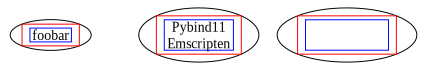
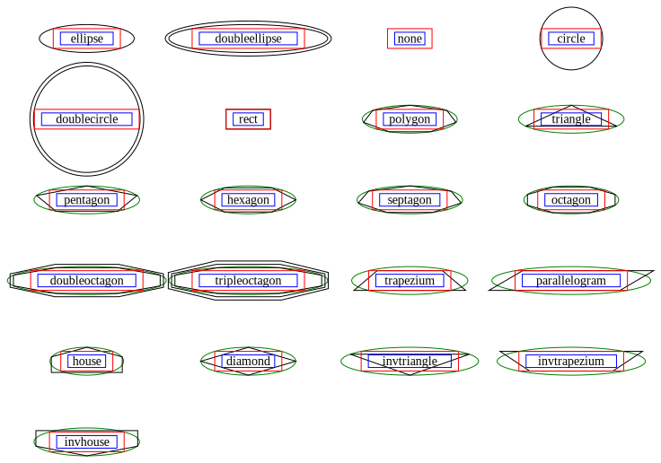
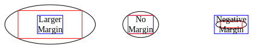
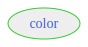
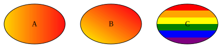
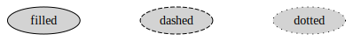

Node Attributes
===============

## Label

`SVGNode` can be configured to display text in a horizontal layout, and the size of its border is determined jointly by the text sizes and the margins.

`````{tab-set}
````{tab-item} Python
```python
from sp_svg_diagram import SVGDiagram

diagram = SVGDiagram()
node1 = diagram.add_node("A")
node1.set_center(0, 0)
node1.set_label("foobar")
node2 = diagram.add_node("B")
node2.set_center(150, 0)
node2.set_label("Pybind11\nEmscripten")
node3 = diagram.add_node("C")
node3.set_center(300, 0)
node3.set_label("星分翼轸\n地接衡庐")
svg = diagram.render()
```
````
````{tab-item} JavaScript
```javascript
import { SVGDiagram } from 'sp-svg-diagram';

const diagram = new SVGDiagram();
const node1 = diagram.addNode("A");
node1.setCenter(0.0, 0.0);
node1.setLabel("foobar");
const node2 = diagram.addNode("B");
node2.setCenter(150.0, 0.0);
node2.setLabel("Pybind11\nEmscripten");
const node3 = diagram.addNode("C");
node3.setCenter(300.0, 0.0);
node3.setLabel("星分翼轸\n地接衡庐");
const svg = diagram.render();
````

````{tab-item} C++
```c++
#include "svg_diagram.h"
using namespace svg_diagram;

int main() {
    SVGDiagram diagram;
    const auto node1 = diagram.addNode("A");
    node1->setCenter(0, 0);
    node1->setLabel("foobar");
    const auto node2 = diagram.addNode("B");
    node2->setCenter(150, 0);
    node2->setLabel("Pybind11\nEmscripten");
    const auto node3 = diagram.addNode("C");
    node3->setCenter(300, 0);
    node3->setLabel("星分翼轸\n地接衡庐");
    diagram.render("label.svg");
    return 0;
}
````
`````


In the figure below, the blue rectangle represents the estimated text size, the red rectangle represents the text box plus the default margin, and the outer frame of the `SVGNode` is the smallest ellipse that can enclose the red rectangle.



### Horizontal Align

Multiline text is center-aligned by default. You can control the alignment of a line by appending `\l` or `\r` at the end of the line. No newline character is required after `\l` or `\r`; if they appear on the last line, the text is treated as having no trailing newline. Since the default rendering only estimates text sizes, using left or right alignment may result in some positional offset.

`````{tab-set}
````{tab-item} Python
```python
from sp_svg_diagram import SVGDiagram

diagram = SVGDiagram()
node1 = diagram.add_node("A")
node1.set_center(0, 0)
node1.set_label("align\\lleft\\lfoobar\\l")
node2 = diagram.add_node("B")
node2.set_center(150, 0)
node2.set_label("align\\rright\\rfoobar\\r")
node3 = diagram.add_node("C")
node3.set_center(300, 0)
node3.set_label("align\\lmixed\\rfoobar")
svg = diagram.render()
```
````
````{tab-item} JavaScript
```javascript
import { SVGDiagram } from 'sp-svg-diagram';

const diagram = new SVGDiagram();
const node1 = diagram.addNode("A");
node1.setCenter(0, 0);
node1.setLabel("align\\lleft\\lfoobar\\l");
const node2 = diagram.addNode("B");
node2.setCenter(150, 0);
node2.setLabel("align\\rright\\rfoobar\\r");
const node3 = diagram.addNode("C");
node3.setCenter(300, 0);
node3.setLabel("align\\lmixed\\rfoobar");
const svg = diagram.render();
````

````{tab-item} C++
```c++
#include "svg_diagram.h"
using namespace svg_diagram;

int main() {
    SVGDiagram diagram;
    const auto node1 = diagram.addNode("A");
    node1->setCenter(0, 0);
    node1->setLabel("align\\lleft\\lfoobar\\l");
    const auto node2 = diagram.addNode("B");
    node2->setCenter(150, 0);
    node2->setLabel("align\\rright\\rfoobar\\r");
    const auto node3 = diagram.addNode("C");
    node3->setCenter(300, 0);
    node3->setLabel("align\\lmixed\\rfoobar");
    diagram.render("label_align.svg");
    return 0;
}
````
`````


## Shape

The default border shape of an SVGNode is an ellipse.

`````{tab-set}
````{tab-item} Python
```python
from sp_svg_diagram import SVGDiagram, SVGNode

diagram = SVGDiagram()
shapes = [
    SVGNode.SHAPE_ELLIPSE,
    SVGNode.SHAPE_DOUBLE_ELLIPSE,
    SVGNode.SHAPE_NONE,
    SVGNode.SHAPE_CIRCLE,
    SVGNode.SHAPE_DOUBLE_CIRCLE,
    SVGNode.SHAPE_RECT,
    SVGNode.SHAPE_POLYGON,
    SVGNode.SHAPE_TRIANGLE,
    SVGNode.SHAPE_PENTAGON,
    SVGNode.SHAPE_HEXAGON,
    SVGNode.SHAPE_SEPTAGON,
    SVGNode.SHAPE_OCTAGON,
    SVGNode.SHAPE_DOUBLE_OCTAGON,
    SVGNode.SHAPE_TRIPLE_OCTAGON,
    SVGNode.SHAPE_TRAPEZIUM,
    SVGNode.SHAPE_PARALLELOGRAM,
    SVGNode.SHAPE_HOUSE,
    SVGNode.SHAPE_DIAMOND,
    SVGNode.SHAPE_INV_TRIANGLE,
    SVGNode.SHAPE_INV_TRAPEZIUM,
    SVGNode.SHAPE_INV_HOUSE,
]
for i, shape in enumerate(shapes):
    node = diagram.add_node(shape)
    node.set_shape(shape)
    node.set_center((i % 4) * 180.0, (i // 4) * 100.0)
    node.set_label(shape)
    if shape == SVGNode.SHAPE_POLYGON:
        node.set_sides(7)
svg = diagram.render()
```
````
````{tab-item} JavaScript
```javascript
import { SVGDiagram, SVGNode } from 'sp-svg-diagram';

const diagram = new SVGDiagram();
const shapes = [
    SVGNode.SHAPE_ELLIPSE,
    SVGNode.SHAPE_DOUBLE_ELLIPSE,
    SVGNode.SHAPE_NONE,
    SVGNode.SHAPE_CIRCLE,
    SVGNode.SHAPE_DOUBLE_CIRCLE,
    SVGNode.SHAPE_RECT,
    SVGNode.SHAPE_POLYGON,
    SVGNode.SHAPE_TRIANGLE,
    SVGNode.SHAPE_PENTAGON,
    SVGNode.SHAPE_HEXAGON,
    SVGNode.SHAPE_SEPTAGON,
    SVGNode.SHAPE_OCTAGON,
    SVGNode.SHAPE_DOUBLE_OCTAGON,
    SVGNode.SHAPE_TRIPLE_OCTAGON,
    SVGNode.SHAPE_TRAPEZIUM,
    SVGNode.SHAPE_PARALLELOGRAM,
    SVGNode.SHAPE_HOUSE,
    SVGNode.SHAPE_DIAMOND,
    SVGNode.SHAPE_INV_TRIANGLE,
    SVGNode.SHAPE_INV_TRAPEZIUM,
    SVGNode.SHAPE_INV_HOUSE,
];
for (const [i, shape] of shapes.entries()) {
    const node = diagram.addNode(shape);
    node.setShape(shape);
    node.setCenter((i % 4) * 180.0, Math.floor(i / 4) * 100.0);
    node.setLabel(shape);
    if (shape === SVGNode.SHAPE_POLYGON) {
        node.setSides(7);
    }
}
const svg = diagram.render();
````

````{tab-item} C++
```c++
#include "svg_diagram.h"
#include <string>
#include <vector>
using namespace svg_diagram;

int main() {
    SVGDiagram diagram;
    const auto shapes = std::vector{
        SVGNode::SHAPE_ELLIPSE,
        SVGNode::SHAPE_DOUBLE_ELLIPSE,
        SVGNode::SHAPE_NONE,
        SVGNode::SHAPE_CIRCLE,
        SVGNode::SHAPE_DOUBLE_CIRCLE,
        SVGNode::SHAPE_RECT,
        SVGNode::SHAPE_POLYGON,
        SVGNode::SHAPE_TRIANGLE,
        SVGNode::SHAPE_PENTAGON,
        SVGNode::SHAPE_HEXAGON,
        SVGNode::SHAPE_SEPTAGON,
        SVGNode::SHAPE_OCTAGON,
        SVGNode::SHAPE_DOUBLE_OCTAGON,
        SVGNode::SHAPE_TRIPLE_OCTAGON,
        SVGNode::SHAPE_TRAPEZIUM,
        SVGNode::SHAPE_PARALLELOGRAM,
        SVGNode::SHAPE_HOUSE,
        SVGNode::SHAPE_DIAMOND,
        SVGNode::SHAPE_INV_TRIANGLE,
        SVGNode::SHAPE_INV_TRAPEZIUM,
        SVGNode::SHAPE_INV_HOUSE,
    };
    for (int i = 0; i < static_cast<int>(shapes.size()); ++i) {
        const auto shape = std::string(shapes[i]);
        const auto node = diagram.addNode(std::string(shapes[i]));
        node->setShape(shapes[i]);
        node->setCenter((i % 4) * 180.0, (i / 4) * 100.0);
        node->setLabel(shape);
        if (shapes[i] == SVGNode::SHAPE_POLYGON) {
            node->setSides(7);
        }
    }
    diagram.render("shape.svg");
    return 0;
}
````
`````


The figure below illustrates the relationship between the border size and the text:



### Record Shape

When using the record shape, you can divide the current node with straight lines either horizontally or vertically. Since there is no `rankdir` property, using `|` at the first level creates a horizontal division. Curly braces `{}` can be used to further subdivide on top of the previous level: the second level defaults to vertical division, and each subsequent level alternates the division direction accordingly.

`````{tab-set}
````{tab-item} Python
```python
from sp_svg_diagram import SVGDiagram, SVGNode

diagram = SVGDiagram()
diagram.default_node_attributes().set_shape(SVGNode.SHAPE_RECORD)
node1 = diagram.add_node("A")
node1.set_center(0, 0)
node1.set_label("horizontal|split|record")
node2 = diagram.add_node("B")
node2.set_center(150, 0)
node2.set_label("{vertical|split|record}")
node3 = diagram.add_node("C")
node3.set_center(300, 0)
node3.set_label("foo|{foobar|{nested||record}|barfoo}|bar")
svg = diagram.render()
```
````
````{tab-item} JavaScript
```javascript
import { SVGDiagram, SVGNode } from 'sp-svg-diagram';

const diagram = new SVGDiagram();
diagram.defaultNodeAttributes().setShape(SVGNode.SHAPE_RECORD);
const node1 = diagram.addNode("A");
node1.setCenter(0, 0);
node1.setLabel("horizontal|split|record");
const node2 = diagram.addNode("B");
node2.setCenter(150, 0);
node2.setLabel("{vertical|split|record}");
const node3 = diagram.addNode("C");
node3.setCenter(300, 0);
node3.setLabel("foo|{foobar|{nested||record}|barfoo}|bar");
const svg = diagram.render();
````

````{tab-item} C++
```c++
#include "svg_diagram.h"
using namespace svg_diagram;

int main() {
    SVGDiagram diagram;
    diagram.defaultNodeAttributes().setShape(SVGNode::SHAPE_RECORD);
    const auto node1 = diagram.addNode("A");
    node1->setCenter(0, 0);
    node1->setLabel("horizontal|split|record");
    const auto node2 = diagram.addNode("B");
    node2->setCenter(150, 0);
    node2->setLabel("{vertical|split|record}");
    const auto node3 = diagram.addNode("C");
    node3->setCenter(300, 0);
    node3->setLabel("foo|{foobar|{nested||record}|barfoo}|bar");
    diagram.render("shape_record.svg");
    return 0;
}
````
`````


## Margin

You can set horizontal and vertical margins. The default values are 8 and 4 respectively.

`````{tab-set}
````{tab-item} Python
```python
from sp_svg_diagram import SVGDiagram

diagram = SVGDiagram()
node1 = diagram.add_node("A")
node1.set_center(0, 0)
node1.set_label("Larger\nMargin")
node1.set_margin(32, 8)
node2 = diagram.add_node("B")
node2.set_center(150, 0)
node2.set_label("No\nMargin")
node2.set_margin(0, 0)
node3 = diagram.add_node("C")
node3.set_center(300, 0)
node3.set_label("Negative\nMargin")
node3.set_margin(-10, -10)
svg = diagram.render()
```
````
````{tab-item} JavaScript
```javascript
import { SVGDiagram } from 'sp-svg-diagram';

const diagram = new SVGDiagram();
const node1 = diagram.addNode("A");
node1.setCenter(0, 0);
node1.setLabel("Larger\nMargin");
node1.setMargin(32, 8);
const node2 = diagram.addNode("B");
node2.setCenter(150, 0);
node2.setLabel("No\nMargin");
node2.setMargin(0, 0);
const node3 = diagram.addNode("C");
node3.setCenter(300, 0);
node3.setLabel("Negative\nMargin");
node3.setMargin(-10, -10);
const svg = diagram.render();
````

````{tab-item} C++
```c++
#include "svg_diagram.h"
using namespace svg_diagram;

int main() {
    SVGDiagram diagram;
    const auto node1 = diagram.addNode("A");
    node1->setCenter(0, 0);
    node1->setLabel("Larger\nMargin");
    node1->setMargin(32, 8);
    const auto node2 = diagram.addNode("B");
    node2->setCenter(150, 0);
    node2->setLabel("No\nMargin");
    node2->setMargin(0);
    const auto node3 = diagram.addNode("C");
    node3->setCenter(300, 0);
    node3->setLabel("Negative\nMargin");
    node3->setMargin(-10);
    diagram.render("margin.svg");
    return 0;
}
````
`````


Although negative margins can be specified, undefined behavior will occur if the absolute value exceeds half of the text size.



## Text Size

By default, the library estimates text size. In the C++ version, you can get a better estimation with the `SVG_DIAGRAM_ENABLE_PANGO_CAIRO` compile option. If you are able to use a different approach to calculate or better estimate text sizes, you can also fix the text box size by configuring the relevant properties.

`````{tab-set}
````{tab-item} Python
```python
from sp_svg_diagram import SVGDiagram

diagram = SVGDiagram()
node1 = diagram.add_node("A")
node1.set_label("🐱🐶🙈🙉🙊")
node2 = diagram.add_node("B")
node2.set_center(0, 50)
node2.set_label("🐱🐶🙈🙉🙊")
node2.set_text_size(80, 16)
svg = diagram.render()
```
````
````{tab-item} JavaScript
```javascript
import { SVGDiagram } from 'sp-svg-diagram';

const diagram = new SVGDiagram();
const node1 = diagram.addNode("A");
node1.setLabel("🐱🐶🙈🙉🙊");
const node2 = diagram.addNode("B");
node2.setCenter(0, 50);
node2.setLabel("🐱🐶🙈🙉🙊");
node2.setTextSize(80, 16);
const svg = diagram.render();
````

````{tab-item} C++
```c++
#include "svg_diagram.h"
using namespace svg_diagram;

int main() {
    SVGDiagram diagram;
    const auto node1 = diagram.addNode("A");
    node1->setLabel("🐱🐶🙈🙉🙊");
    const auto node2 = diagram.addNode("B");
    node2->setLabel("🐱🐶🙈🙉🙊");
    node2->setCenter(0, 50);
    node2->setPrecomputedTextSize(80, 16);
    diagram.render("text_size.svg");
    return 0;
}
````
`````


In the figure below, the blue rectangle represents the size of the text:


## Node Size

You can directly set the size of an `SVGNode`. When this property is set, both the text size and margin will be ignored.

`````{tab-set}
````{tab-item} Python
```python
from sp_svg_diagram import SVGDiagram

diagram = SVGDiagram()
node1 = diagram.add_node("A")
node1.set_label("A")
node2 = diagram.add_node("B")
node2.set_label("B")
node2.set_center(150, 0)
node2.set_fixed_size(80, 30)
svg = diagram.render()
```
````
````{tab-item} JavaScript
```javascript
import { SVGDiagram } from 'sp-svg-diagram';

const diagram = new SVGDiagram();
const node1 = diagram.addNode("A");
node1.setLabel("A");
const node2 = diagram.addNode("B");
node2.setLabel("B");
node2.setCenter(150, 0);
node2.setFixedSize(80, 30);
const svg = diagram.render();
````

````{tab-item} C++
```c++
#include "svg_diagram.h"
using namespace svg_diagram;

int main() {
    SVGDiagram diagram;
    const auto node1 = diagram.addNode("A");
    node1->setLabel("A");
    const auto node2 = diagram.addNode("B");
    node2->setLabel("B");
    node2->setCenter(150, 0);
    node2->setFixedSize(80, 30);
    diagram.render("node_size.svg");
    return 0;
}
````
`````


## Color

### Solid Color

There are three color-related properties: `color` sets the node's border color, `fillColor` sets the node's fill color, and `fontColor` sets the text color. Any color format supported by SVG can be used.

`````{tab-set}
````{tab-item} Python
```python
from sp_svg_diagram import SVGDiagram

diagram = SVGDiagram()
node = diagram.add_node("A")
node.set_label("color")
node.set_color("limegreen")
node.set_fill_color("#EEEEEE")
node.set_font_color("rgb(66,92,214)")
svg = diagram.render()
```
````
````{tab-item} JavaScript
```javascript
import { SVGDiagram } from 'sp-svg-diagram';

const diagram = new SVGDiagram();
const node = diagram.addNode("A");
node.setLabel("color");
node.setColor("limegreen");
node.setFillColor("#EEEEEE");
node.setFontColor("rgb(66,92,214)");
const svg = diagram.render();
````

````{tab-item} C++
```c++
#include "svg_diagram.h"
using namespace svg_diagram;

int main() {
    SVGDiagram diagram;
    const auto node = diagram.addNode("A");
    node->setLabel("color");
    node->setColor("limegreen");
    node->setFillColor("#EEEEEE");
    node->setFontColor("rgb(66,92,214)");
    diagram.render("color.svg");
    return 0;
}
````
`````



### Opacity

You can set the opacity using `#RRGGBBAA`, where the last two hexadecimal digits represent the alpha (opacity) value.

`````{tab-set}
````{tab-item} Python
```python
import math

from sp_svg_diagram import SVGDiagram

diagram = SVGDiagram()
ids = ["A", "B", "C"]
colors = ["#00FFFFCC", "#FF00FFCC", "#FFFF00CC"]
for i, (node_id, color) in enumerate(zip(ids, colors)):
    node = diagram.add_node(node_id)
    angle = -math.pi / 2.0 + math.pi * 2 * i / 3.0
    node.set_center(50.0 * math.cos(angle), 50.0 * math.sin(angle))
    node.set_fixed_size(150, 150)
    node.set_color("none")
    node.set_fill_color(colors[i])
svg = diagram.render()
```
````
````{tab-item} JavaScript
```javascript
import { SVGDiagram } from 'sp-svg-diagram';

const diagram = new SVGDiagram();
const ids = ["A", "B", "C"];
const colors = ["#00FFFFCC", "#FF00FFCC", "#FFFF00CC"];
for (const [i, node_id] of ids.entries()) {
    const node = diagram.addNode(node_id);
    const angle = -Math.PI / 2.0 + Math.PI * 2 * i / 3.0;
    node.setCenter(50.0 * Math.cos(angle), 50.0 * Math.sin(angle));
    node.setFixedSize(150, 150);
    node.setColor("none");
    node.setFillColor(colors[i]);
}
const svg = diagram.render();
````

````{tab-item} C++
```c++
#include <vector>
#include <string>
#include <cmath>
#include "svg_diagram.h"
using namespace svg_diagram;

int main() {
    SVGDiagram diagram;
    const std::vector<std::string> ids = {"A", "B", "C"};
    const std::vector<std::string> colors = {"#00FFFFCC", "#FF00FFCC", "#FFFF00CC"};
    for (int i = 0; i < static_cast<int>(ids.size()); ++i) {
        const auto node = diagram.addNode(ids[i]);
        const double angle = -std::numbers::pi / 2.0 + std::numbers::pi * 2 * i / 3.0;
        node->setCenter(50.0 * cos(angle), 50.0 * sin(angle));
        node->setFixedSize(150, 150);
        node->setColor("none");
        node->setFillColor(colors[i]);
    }
    diagram.render("opacity.svg");
    return 0;
}
````
`````


### Gradient

When multiple colors separated by `:` are specified, a linear color gradient is used for filling by default, with the default direction from left to right. The direction can be adjusted using `gradientAngle`.

Appending `;` followed by a positive number less than `1.0` to a color specifies the proportion of the overall fill that the color occupies. If any color defines a proportion, the fill switches to a segmented (non-gradient) color fill. In this case, any colors without an explicitly defined proportion will evenly share the remaining proportion.

`````{tab-set}
````{tab-item} Python
```python
from sp_svg_diagram import SVGDiagram

diagram = SVGDiagram()
node1 = diagram.add_node("A")
node1.set_fill_color("gold:#FF0000EE")
node1.set_label("A")
node1.set_fixed_size(120, 80)
node2 = diagram.add_node("B")
node2.set_center(150, 0)
node2.set_fill_color("gold:#FF0000EE")
node2.set_label("B")
node2.set_gradient_angle(45)
node2.set_fixed_size(120, 80)
node3 = diagram.add_node("C")
node3.set_center(300, 0)
node3.set_fill_color("white;1e-6:red:orange:yellow:green:blue:purple")
node3.set_label("C")
node3.set_gradient_angle(-90)
node3.set_fixed_size(120, 80)
svg = diagram.render()
```
````
````{tab-item} JavaScript
```javascript
import { SVGDiagram } from 'sp-svg-diagram';

const diagram = new SVGDiagram();
const node1 = diagram.addNode("A");
node1.setFillColor("gold:#FF0000EE");
node1.setLabel("A");
node1.setFixedSize(120, 80);
const node2 = diagram.addNode("B");
node2.setCenter(150, 0);
node2.setFillColor("gold:#FF0000EE");
node2.setLabel("B");
node2.setGradientAngle(45);
node2.setFixedSize(120, 80);
const node3 = diagram.addNode("C");
node3.setCenter(300, 0);
node3.setFillColor("white;1e-6:red:orange:yellow:green:blue:purple");
node3.setLabel("C");
node3.setGradientAngle(-90);
node3.setFixedSize(120, 80);
const svg = diagram.render();
````

````{tab-item} C++
```c++
#include "svg_diagram.h"
using namespace svg_diagram;

int main() {
    SVGDiagram diagram;
    const auto node1 = diagram.addNode("A");
    node1->setFillColor("gold:#FF0000EE");
    node1->setLabel("A");
    node1->setFixedSize(120, 80);
    const auto node2 = diagram.addNode("B");
    node2->setCenter(150, 0);
    node2->setFillColor("gold:#FF0000EE");
    node2->setLabel("B");
    node2->setGradientAngle(45);
    node2->setFixedSize(120, 80);
    const auto node3 = diagram.addNode("C");
    node3->setCenter(300, 0);
    node3->setFillColor("white;1e-6:red:orange:yellow:green:blue:purple");
    node3->setLabel("C");
    node3->setGradientAngle(-90);
    node3->setFixedSize(120, 80);
    diagram.render("gradient_color.svg");
    return 0;
}
````
`````



## Pen Width

The stroke width of the node's border.

`````{tab-set}
````{tab-item} Python
```python
from sp_svg_diagram import SVGDiagram

diagram = SVGDiagram()
for i in range(3):
    pen_width = 1 + i * 2
    node = diagram.add_node(f"node{i}")
    node.set_center(i * 150, 0)
    node.set_label(f"penWidth={pen_width}")
    node.set_pen_width(pen_width)
svg = diagram.render()
```
````
````{tab-item} JavaScript
```javascript
import { SVGDiagram } from 'sp-svg-diagram';

const diagram = new SVGDiagram();
for (let i = 0; i < 3; i++) {
    const penWidth = 1 + i * 2;
    const node = diagram.addNode(`node${i}`);
    node.setCenter(i * 150, 0);
    node.setLabel(`penWidth=${penWidth}`);
    node.setPenWidth(penWidth);
}
const svg = diagram.render();
````

````{tab-item} C++
```c++
#include "svg_diagram.h"
#include <format>
using namespace svg_diagram;

int main() {
    SVGDiagram diagram;
    for (int i = 0; i < 3; ++i) {
        const auto penWidth = 1 + i * 2;
        const auto node = diagram.addNode(std::format("node{}", i));
        node->setCenter(i * 150, 0);
        node->setLabel(std::format("penWidth={}", penWidth));
        node->setPenWidth(penWidth);
    }
    diagram.render("pen_width.svg");
    return 0;
}
````
`````


## Font

`````{tab-set}
````{tab-item} Python
```python
from sp_svg_diagram import SVGDiagram

diagram = SVGDiagram()
for i in range(3):
    font_size = 14 + i
    node = diagram.add_node(f"node{i}")
    node.set_center(i * 150, 0)
    node.set_label(f"fontSize={font_size}")
    node.set_font_name("Consolas")
    node.set_font_size(font_size)
    node.set_font("Consolas,'Courier New',monospace", font_size)
svg = diagram.render()
```
````
````{tab-item} JavaScript
```javascript
import { SVGDiagram } from 'sp-svg-diagram';

const diagram = new SVGDiagram();
for (let i = 0; i < 3; i++) {
    const fontSize = 14 + i;
    const node = diagram.addNode(`node${i}`);
    node.setCenter(i * 150, 0);
    node.setLabel(`fontSize=${fontSize}`);
    node.setFontName("Consolas")
    node.setFontSize(fontSize)
    node.setFont("Consolas,'Courier New',monospace", fontSize)
}
const svg = diagram.render();
````

````{tab-item} C++
```c++
#include "svg_diagram.h"
#include <format>
using namespace svg_diagram;

int main() {
    SVGDiagram diagram;
    for (int i = 0; i < 3; ++i) {
        const auto fontSize = 14 + i;
        const auto node = diagram.addNode(std::format("node{}", i));
        node->setCenter(i * 150, 0);
        node->setLabel(std::format("fontSize={}", fontSize));
        node->setFontName("Consolas");
        node->setFontSize(fontSize);
        node->setFont("Consolas,'Courier New',monospace", fontSize);
    }
    diagram.render("font.svg");
    return 0;
}
````
`````


## Stroke Style

The default node border style is `solid`, rendered as solid lines. Two dashed styles are also available: `dashed` and `dotted`. These three styles are mutually exclusive, and the one specified last takes precedence.

`````{tab-set}
````{tab-item} Python
```python
from sp_svg_diagram import SVGDiagram

diagram = SVGDiagram()
labels = ["solid", "dashed", "dotted"]
for i, label in enumerate(labels):
    node = diagram.add_node(f"node{i}")
    node.set_center(i * 150, 0)
    node.set_label(label)
    node.set_fill_color("lightgray")
    if i == 1:
        node.append_style_dashed()
    elif i == 2:
        node.append_style_dotted()
svg = diagram.render()
```
````
````{tab-item} JavaScript
```javascript
import { SVGDiagram } from 'sp-svg-diagram';

const diagram = new SVGDiagram();
const labels = ["solid", "dashed", "dotted"]
for (const [i, label] of labels.entries()) {
    const node = diagram.addNode(`node${i}`);
    node.setCenter(i * 150, 0);
    node.setLabel(label);
    node.setFillColor("lightgray");
    if (i === 1) {
        node.appendStyleDashed();
    } else if (i === 2) {
        node.appendStyleDotted();
    }
}
const svg = diagram.render();
````

````{tab-item} C++
```c++
#include "svg_diagram.h"
#include <format>
#include <vector>
#include <string>
using namespace svg_diagram;

int main() {
    SVGDiagram diagram;
    const auto labels = std::vector<std::string>({"solid", "dashed", "dotted"});
    for (int i = 0; i < static_cast<int>(labels.size()); ++i) {
        const auto node = diagram.addNode(std::format("node{}", i));
        node->setCenter(i * 150, 0);
        node->setLabel(labels[i]);
        node->setFillColor("lightgray");
        if (i == 1) {
            node->appendStyleDashed();
        } else if (i == 2) {
            node->appendStyleDotted();
        }
    }
    diagram.render("stroke_style.svg");
    return 0;
}
````
`````



## Peripheries

The `peripheries` attribute controls the number of concentric borders drawn around a node. The default value is 1. Shapes like `doublecircle` and `doubleellipse` are equivalent to `circle` and `ellipse` with `peripheries=2`. You can also use shapes like `doubleoctagon` (peripheries=2) and `tripleoctagon` (peripheries=3).

`````{tab-set}
````{tab-item} Python
```python
from sp_svg_diagram import SVGDiagram, SVGNode

diagram = SVGDiagram()
shapes = [
    SVGNode.SHAPE_CIRCLE,
    SVGNode.SHAPE_ELLIPSE,
    SVGNode.SHAPE_RECT,
    SVGNode.SHAPE_OCTAGON,
]
for i, shape in enumerate(shapes):
    node = diagram.add_node(shape)
    node.set_shape(shape)
    node.set_center(i * 120.0, 0)
    node.set_label(shape)
    node.set_peripheries(2)
svg = diagram.render()
```
````
````{tab-item} JavaScript
```javascript
import { SVGDiagram, SVGNode } from 'sp-svg-diagram';

const diagram = new SVGDiagram();
const shapes = [
    SVGNode.SHAPE_CIRCLE,
    SVGNode.SHAPE_ELLIPSE,
    SVGNode.SHAPE_RECT,
    SVGNode.SHAPE_OCTAGON,
];
for (const [i, shape] of shapes.entries()) {
    const node = diagram.addNode(shape);
    node.setShape(shape);
    node.setCenter(i * 120.0, 0);
    node.setLabel(shape);
    node.setPeripheries(2);
}
const svg = diagram.render();
````

````{tab-item} C++
```c++
#include "svg_diagram.h"
#include <string>
#include <vector>
using namespace svg_diagram;

int main() {
    SVGDiagram diagram;
    const auto shapes = std::vector{
        SVGNode::SHAPE_CIRCLE,
        SVGNode::SHAPE_ELLIPSE,
        SVGNode::SHAPE_RECT,
        SVGNode::SHAPE_OCTAGON,
    };
    for (int i = 0; i < static_cast<int>(shapes.size()); ++i) {
        const auto shape = std::string(shapes[i]);
        const auto node = diagram.addNode(shape);
        node->setShape(shapes[i]);
        node->setCenter(i * 120.0, 0);
        node->setLabel(shape);
        node->setPeripheries(2);
    }
    diagram.render("peripheries.svg");
    return 0;
}
````
`````


